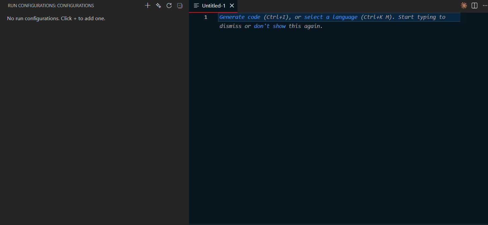
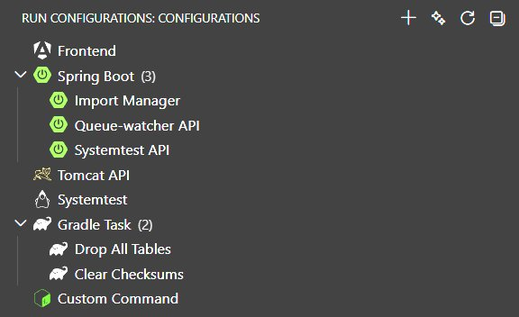
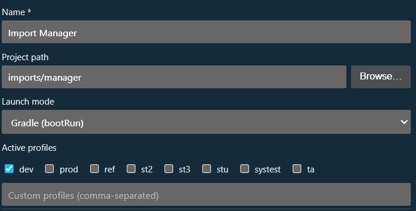
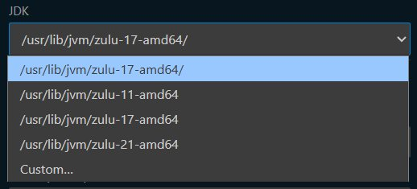
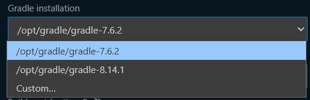
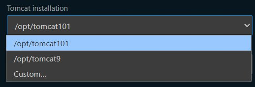
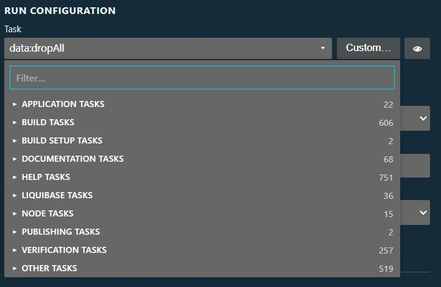
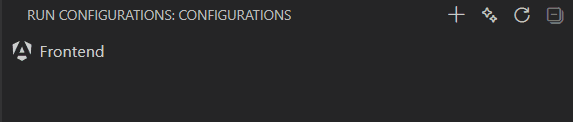

# Run Configuration Manager

IntelliJ-style run configurations for VS Code. Save, share, and launch your project's run commands from the Activity Bar — without memorizing terminal flags or digging through scripts.

> **The extension does the heavy lifting for you.** Open the `+` dialog, pick your project — and the extension scans your codebase, finds your scripts, detects your JDKs, locates your main classes, and pre-fills the form. Most configurations are ready to save in just a few clicks, with no manual research required.

*Example — add npm (Angular) Run Config*

*Example — add Quarkus Run Config*

## What it does

The extension adds a **Run Configurations** panel to the Activity Bar. Each entry in the panel represents a saved way to start (or debug) your application. Click once to run, click again to stop. No terminal knowledge required.

Configurations are stored in `.vscode/run.json` so you can commit them and share them with your whole team. Everyone gets the same one-click experience.

## Supported project types

| Type | What it runs |
|---|---|
| **npm / Node.js** | Any `package.json` script, with your choice of npm, yarn, or pnpm |
| **Spring Boot** | Maven, Gradle, or direct Java launch — auto-detects your project setup |
| **Quarkus** | Maven or Gradle dev mode with Live Coding |
| **Tomcat** | Deploys your WAR or exploded directory to a managed Tomcat instance |
| **Java Application** | Plain Java apps via Maven exec, Gradle run, or direct `java` launch |
| **Maven Goal** | Any Maven phase or plugin goal, saved as a one-click button |
| **Gradle Task** | Any Gradle task from your build, saved as a one-click button |
| **Docker** | Start / stop a local container — container details auto-detected |
| **Custom Command** | Any shell command — pipes, globs, environment variables, all supported |

## Key features

**Auto-detection** — Click `+` and the extension scans your project. Main classes, JDK locations, build tools, profiles, and available scripts are all discovered for you. The form opens instantly and fills in as scanning completes in the background.

  

**Live startup status** — The panel shows exactly what your app is doing. Configurations cycle through visual states (Preparing → Starting → Running → Started / Failed) based on real terminal output. You see the actual state of your app, not just whether a process is alive.

**One-click debugging** — Every configuration that supports it has a Debug button alongside Run. The extension handles attaching the debugger automatically — no separate launch configuration to maintain.

**Rich terminal output** — The integrated terminal colors log levels, turns file paths and URLs into clickable links, and highlights startup success or failure lines so important output is never buried.

**Environment variables and path tokens** — Set per-configuration environment variables and use `${workspaceFolder}`, `${userHome}`, and other tokens anywhere in your configuration. The on-disk file keeps the tokens; the extension resolves them at launch time.

**Multi-root workspace support** — Works across multi-folder workspaces. Each folder has its own set of configurations. Stop All in the title bar stops every running configuration at once.

**Shareable configs** — Commit `.vscode/run.json` and your teammates open the same sidebar with the same configured run commands, ready to use.

## Advanced workflows

### Dependency chains

A run configuration can declare other configurations it depends on. When you start the parent, the extension starts each dependency first, waits for it to reach running state, optionally waits a user-set delay, then starts the next step. The whole chain is visible in the sidebar — dependencies render as tree children, and the tree auto-expands during a run so you can see exactly which step is queued, starting, or failed. Cycles are detected at run time.

Set dependencies on any config via the "Depends on" field in the Advanced section of the form. Each entry includes the target (another run config, a VS Code launch config, or a task from `tasks.json`) plus a delay in seconds. Order matters and is editable via up/down buttons.

### Groups

Right-click any configuration and choose **Add to Group…** to bundle it with others — the picker lets you pick an existing group or create a new one inline. Groups show as folder nodes in the sidebar with their members underneath.

Right-click a group to:
- **Run All Sequentially** — starts one member, waits for it to reach running, then the next. Members with their own `dependsOn` chains still have their dependencies started first. Any member's failure aborts the rest, which stay visible as "skipped" so you can see where it broke.
- **Run All in Parallel** — dispatches every member at once.
- **Rename** / **Delete** — deleting a group unassigns its members; the configs themselves stay, just ungrouped.

Queued and currently-starting members are overlaid with clock and spinner icons so the pipeline is readable at a glance.

### Launch & Tasks integration

A sibling "Launch & Tasks" view surfaces every `.vscode/launch.json` launch config and workspace task from `tasks.json`, same tree, hover-to-Run, hover-to-Stop. Launch configs with `preLaunchTask` / `postDebugTask` / compound members expand to show the chain; tasks with `dependsOn` expand recursively.

Clicking a launch or task opens a read-only virtual document showing the JSON plus every dependency inlined — useful for quickly understanding what a compound does without jumping between files.

Debug sessions started from VS Code's own Run & Debug panel also appear as running here, and can be stopped from the same tree.

### Docker

Create a Docker run config and the form lists your local containers grouped by running / stopped, sorted running-first. Pick one and the Info panel fills with image, state, created timestamp, port mappings, volumes, and environment — so you can verify you picked the right one before saving. Clicking a docker config in the sidebar opens a live log tail terminal (`docker logs -f`); the Run / Stop buttons drive the container directly.

### Right-click actions

Every config's right-click menu offers type-appropriate shortcuts — no manual `mvn` / `gradle` / `npm` typing:

- **Maven configs**: Clean · Build (package -DskipTests) · Test, each with the Maven icon.
- **Gradle configs**: Clean · Build (assemble) · Test, each with the Gradle icon.
- **npm configs**: Install · Update · Prune.

These shortcuts reuse the config's resolved `buildRoot`, `:module:` prefix, and JDK path, so they run against the exact same project state as the main run action. For multi-module Gradle projects that means the right module, not a top-level rebuild.

### Dependency-aware build context

Saved configs never assume defaults they can't prove. The "Port" field is populated from the actual project (reads `application-<profile>.properties` for Spring Boot, `quarkus.http.port` for Quarkus, `package.json` scripts or framework convention for npm) — and left blank when nothing could be determined, rather than guessing 8080. Re-runs fire when the profile changes, so picking `dev` fills in the port from `application-dev.properties`.

### Find Blocking Ports

Click the `…` menu on the Configurations view → **Find Blocking Ports**. Opens a searchable, sortable table of every listening port on your machine — port, address, PID, process, protocol — and highlights in green or red any port that matches one of your configurations (green = your config is running on it, red = your config expects it but it's blocked by something else). A Kill button on each row terminates the offending process after confirmation. Built on `ss` / `lsof` / `netstat` depending on platform (Linux / macOS / Windows).

### Proactive warnings

When you enable a feature that needs a specific prerequisite in your project, the form surfaces an inline yellow warning with the fix:

- **Spring Boot / Tomcat → Rebuild on save**: warns when `spring-boot-devtools` isn't declared in `build.gradle` / `pom.xml` (hot reload would silently do nothing without it).
- **Spring Boot / Tomcat → Colored log output**: warns when a custom `logback-spring.xml` / `logback.xml` / `log4j2.xml` is present — your project's pattern would override the extension's color injection.
- **Tomcat → Reloadable context + WAR artifact**: warns that reloadable only takes effect for exploded deployments, not packaged WARs.

Warnings are gated on the feature actually being enabled, so the form stays clean until the user opts in.

### Stale-config detection

Configurations saved against an older version of the extension get flagged in the sidebar with a warning icon when a detection improvement would now produce different values. The tooltip explains what changed and suggests re-creating — no silent breakage when you upgrade.

## Getting started

1. Click the **Run Configurations** icon in the Activity Bar.
2. Click **+** to add a configuration — the extension auto-detects your project type.
3. Review the pre-filled form and click **Save**.
4. Press the play button next to your new configuration to run it.

That's it. Edit or delete configurations at any time from the same panel.
