

# Run Configuration Manager

IntelliJ-style run configurations for VS Code. Save, share, and launch your project's run commands from the Activity Bar — without memorizing terminal flags or digging through scripts.

> **The extension does the heavy lifting for you.** Open the `+` dialog, pick your project — and the extension scans your codebase, finds your scripts, detects your JDKs, locates your main classes, and pre-fills the form. Most configurations are ready to save in just a few clicks, with no manual research required.

*Example — add npm (Angular) Run Config*
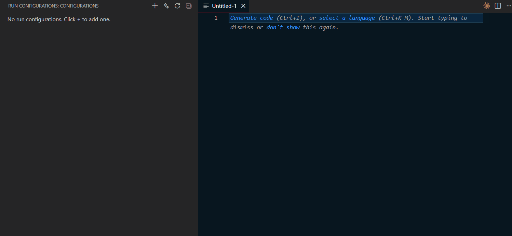

*Example — add Quarkus Run Config*

## What it does

The extension adds a **Run Configurations** panel to the Activity Bar. Each entry in the panel represents a saved way to start (or debug) your application. Click once to run, click again to stop. No terminal knowledge required.

Configurations are stored in `.vscode/run.json` so you can commit them and share them with your whole team. Everyone gets the same one-click experience.

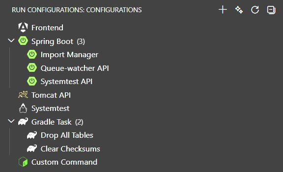

## Supported project types

| Type | What it runs |
|---|---|
| **npm / Node.js** | Any `package.json` script, with your choice of npm, yarn, or pnpm. Auto-detects installed Node interpreters (system, nvm, volta, asdf, fnm, n, the extension's own install root) and lets you pin one per config. |
| **Python** | Five launch modes — script, module (`-m`), framework, pytest, custom. Detects venvs (`.venv` / `venv` / `env` / `$VIRTUAL_ENV`) plus pyenv / asdf / rye / uv / mise / conda. Pre-fills entry-point scripts (`if __name__ == "__main__":`) and importable modules (`__main__.py`). |
| **Go** | Five launch modes — `go run`, `go test`, `go build`, `go install`, custom. Auto-detects Go installations from `$GOROOT`, `which go`, and version managers (gvm, asdf, mise, goenv). Scans for `package main` entry points. Race detector and build flag support built in. |
| **Spring Boot** | Maven, Gradle, or direct Java launch — auto-detects your project setup |
| **Quarkus** | Maven or Gradle dev mode with Live Coding |
| **Tomcat** | Deploys your WAR or exploded directory to a managed Tomcat instance |
| **Java Application** | Plain Java apps via Maven exec, Gradle run, or direct `java` launch |
| **Maven Goal** | Any Maven phase or plugin goal, saved as a one-click button |
| **Gradle Task** | Any Gradle task from your build, saved as a one-click button |
| **Docker** | Start / stop a local container — container details auto-detected |
| **HTTP Request** | curl-style HTTP requests with auth, headers, body, and JS post-response assertions |
| **Custom Command** | Any shell command — pipes, globs, environment variables, all supported |

## Key features

**Auto-detection** — Click `+` and the extension scans your project. Main classes, JDK locations, build tools, profiles, and available scripts are all discovered for you. The form opens instantly and fills in as scanning completes in the background.

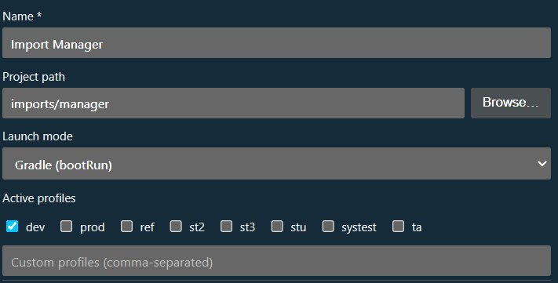

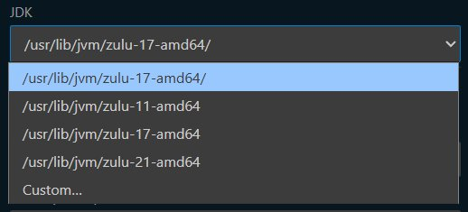 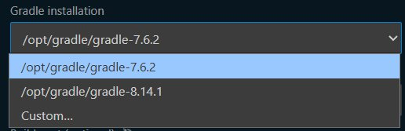 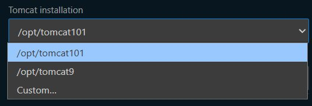

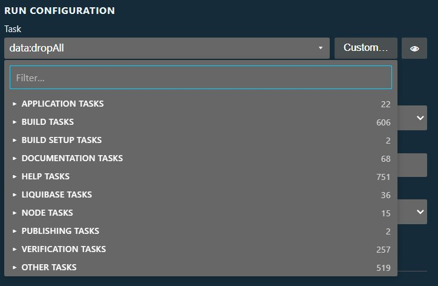

**Live startup status** — The panel shows exactly what your app is doing. Configurations cycle through visual states (Preparing → Starting → Running → Started / Failed) based on real terminal output. You see the actual state of your app, not just whether a process is alive.

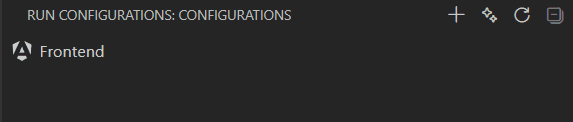

**One-click debugging** — Every configuration that supports it has a Debug button alongside Run. The extension handles attaching the debugger automatically — no separate launch configuration to maintain. Go debug is powered by [Delve](https://github.com/go-delve/delve) via the official `golang.go` extension.

**Rich terminal output** — The integrated terminal colors log levels, turns file paths and URLs into clickable links, and highlights startup success or failure lines so important output is never buried.

**Environment variables and path tokens** — Set per-configuration environment variables and use `${workspaceFolder}`, `${userHome}`, and other tokens anywhere in your configuration. The on-disk file keeps the tokens; the extension resolves them at launch time.

**Multi-root workspace support** — Works across multi-folder workspaces. Each folder has its own set of configurations. Stop All in the title bar stops every running configuration at once.

**Linger mode for crash diagnosis** — A per-config "Close terminal as soon as process ends" toggle (default on, matching the original behavior). Switch it off and the integrated terminal stays open after the process exits — Stop button included — so you can scroll back through the logs of a crashed run before dismissing it with any keypress, like VS Code's built-in launcher.

**Live command preview** — A read-only line at the bottom of the form shows the exact command the extension will execute, including resolved `cd <projectPath>` prefix, interpreter args, framework invocation, etc. Updates as you edit the form so you can verify before saving.

**Shareable configs** — Commit `.vscode/run.json` and your teammates open the same sidebar with the same configured run commands, ready to use. The on-disk format is versioned and migrated forward automatically — older configs work after extension upgrades without manual intervention.

## Advanced workflows

### Dependency chains

A run configuration can declare other configurations it depends on. When you start the parent, the extension starts each dependency first, waits for it to reach running state, optionally waits a user-set delay, then starts the next step. The whole chain is visible in the sidebar — dependencies render as tree children, and the tree auto-expands during a run so you can see exactly which step is queued, starting, or failed. Cycles are detected at run time.

Set dependencies on any config via the "Depends on" field in the Advanced section of the form. Each entry includes the target (another run config, a VS Code launch config, or a task from `tasks.json`) plus a delay in seconds. Order matters and is editable via up/down buttons.

### Groups

Right-click any configuration and choose **Add to Group…** to bundle it with others — the picker lets you pick an existing group or create a new one inline. Groups show as folder nodes in the sidebar with their members underneath, and folders can be nested (drag-and-drop a group onto another to nest, drag back to root to flatten).

Right-click a group to:
- **Run All Sequentially** — starts one member, waits for it to reach running, then the next. Members with their own `dependsOn` chains still have their dependencies started first. Any member's failure aborts the rest, which stay visible as "skipped" so you can see where it broke. Recurses into sub-folders.
- **Run All in Parallel** — dispatches every member at once. Recurses into sub-folders.
  - **Debug All Sequentially** / **Debug All in Parallel** — same flows but routes debuggable configs (Java / Spring Boot / Quarkus / Python / npm / Go) through the debugger automatically, while non-debuggable members fall back to a normal run so the whole group still starts.
- **Stop All** — terminates every running member, including those in sub-folders.
- **Rename** / **Delete** — deleting a group unassigns its members; the configs themselves stay, just ungrouped.

Queued and currently-starting members are overlaid with clock and spinner icons so the pipeline is readable at a glance.

### Launch & Tasks integration

A sibling "Launch & Tasks" view surfaces every `.vscode/launch.json` launch config and workspace task from `tasks.json`, same tree, hover-to-Run, hover-to-Stop. Launch configs with `preLaunchTask` / `postDebugTask` / compound members expand to show the chain; tasks with `dependsOn` expand recursively.

Clicking a launch or task opens a read-only virtual document showing the JSON plus every dependency inlined — useful for quickly understanding what a compound does without jumping between files.

Debug sessions started from VS Code's own Run & Debug panel also appear as running here, and can be stopped from the same tree.

### Docker

Create a Docker run config and the form lists your local containers grouped by running / stopped, sorted running-first. Pick one and the Info panel fills with image, state, created timestamp, port mappings, volumes, and environment — so you can verify you picked the right one before saving. Clicking a docker config in the sidebar opens a live log tail terminal (`docker logs -f`); the Run / Stop buttons drive the container directly.

### Right-click actions

Every config's right-click menu offers type-appropriate shortcuts — no manual `mvn` / `gradle` / `npm` / `go` typing:

- **Maven configs**: Clean · Build (package -DskipTests) · Test, each with the Maven icon.
- **Gradle configs**: Clean · Build (assemble) · Test, each with the Gradle icon.
- **npm configs**: Install · Update · Prune.
- **Python configs**: Install (editable) · Install requirements.txt · Upgrade dependencies · Freeze · List.
- **Go configs**: `go mod tidy` · `go mod download` · `go build ./...` · `go test ./...`.

These shortcuts reuse the config's resolved `buildRoot`, `:module:` prefix, and tool path, so they run against the exact same project state as the main run action. For multi-module Gradle projects that means the right module, not a top-level rebuild.

### JVM monitoring

Any JVM-based configuration can be launched with live monitoring attached. A small JMX agent ships with the extension; when you start a config with monitoring, the agent connects to your application's JVM and streams memory, thread, GC, and runtime metrics in real time — first as a compact sparkline + heap MB + CPU% right in the sidebar row, and in full detail in a dedicated **Monitor** view.

**How to activate it** — right-click a monitorable config (Spring Boot, Quarkus, Java Application, or Tomcat running through Maven or Gradle) and choose:

- **Run with Monitoring** — starts the app and attaches the agent.
- **Debug with Monitoring** — same, but also attaches the debugger.

Once it's running, right-click the config again and choose **Open Monitor View** to open the full dashboard. No JMX ports, agent flags, or VisualVM setup required — the extension injects the right JVM arguments through each runtime's fork-safe channel and wires everything up for you. (Node configs get their own monitoring view — see below; Python, Go, Docker, and HTTP configs are not monitored.)

The Monitor view has a time-window selector (60s / 5min / 30min), a **Save heap dump** button (writes an `.hprof` you can open in your profiler of choice), and four tabs.

**Memory** — an auto-scaled heap-usage chart, at-a-glance cards (heap used / committed, last GC pause, process CPU, live thread count, off-heap usage, open file descriptors), per-pool gauges (Young / Survivor / Old gen, Metaspace, Code Cache), a GC timeline, direct/mapped buffer usage, the current allocation rate, and a live class histogram you can filter, sort, and pause.

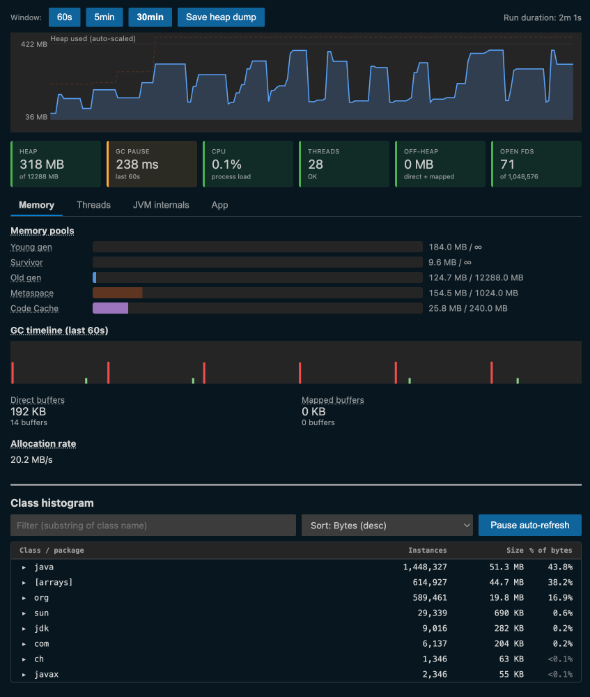

**Threads** — a thread-state donut (RUNNABLE / WAITING / TIMED_WAITING / …), total thread count over time, and a "top threads by CPU" table with each thread's state and a stack snippet so you can spot a hot or stuck thread immediately.

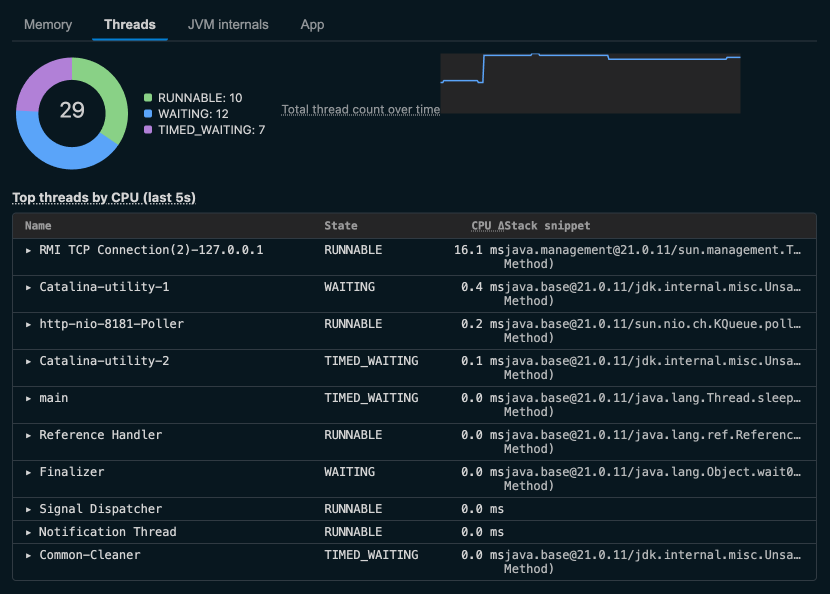

**JVM internals** — runtime facts (vendor, VM, version, PID, uptime), class-loading counters, JIT compile time, and operating-system metrics (load average, free/total RAM, swap, file descriptors), plus expandable lists of the JVM args, system properties, and environment variables the process was launched with.

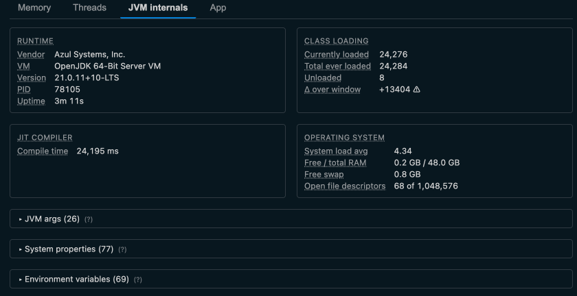

The **App** tab surfaces application-level metrics when available. Every metric carries a hover tooltip explaining what it means, and the whole view streams live — close it any time; monitoring keeps running until you stop the configuration.

### Node monitoring

npm configurations get the same one-click monitoring, with a view tailored to Node instead of the JVM — so you only ever see metrics that make sense for your runtime, never empty Java placeholders. A tiny, dependency-free agent ships with the extension and is loaded into your process at launch (via `NODE_OPTIONS=--require`); it streams live V8 and libuv metrics back to the extension over a local socket. Nothing to install or configure.

**How to activate it** — right-click any npm config and choose **Run with Monitoring** or **Debug with Monitoring** (the agent coexists with the JS debugger). Once it's running, the sidebar row shows live RSS + CPU, and **Open Monitor View** opens the dashboard. The view has the same time-window selector (60s / 5min / 30min) and a **Save heap snapshot** button that writes a `.heapsnapshot` you can open in Chrome DevTools or VS Code.

Three tabs, all Node-native:

- **Memory** — RSS and heap-used over time, at-a-glance cards (heap used / limit, RSS, CPU, event-loop lag p99, active handles, GC pause), V8 heap-space gauges (new / old / code / large-object space), external + ArrayBuffer usage, a GC timeline, and the current allocation rate.
- **Event loop** — event-loop lag (mean / p99 / max) over time plus active handle and request counts — the fastest way to see when the loop is blocked. This is the Node-native counterpart to the JVM "Threads" view.
- **Runtime** — Node and V8 versions, PID, platform/arch, exec path, working directory, uptime, and expandable argv and environment-variable lists.

Heap snapshots, Debug-with-Monitoring, and the live sidebar readout all work the same as the JVM experience; the data and labels are simply adapted to Node.

### Dependency-aware build context

Saved configs never assume defaults they can't prove. The "Port" field is populated from the actual project (reads `application-<profile>.properties` for Spring Boot, `quarkus.http.port` for Quarkus, `package.json` scripts or framework convention for npm) — and left blank when nothing could be determined, rather than guessing 8080. Re-runs fire when the profile changes, so picking `dev` fills in the port from `application-dev.properties`.

### Find Blocking Ports

Click the `…` menu on the Configurations view → **Find Blocking Ports**. Opens a searchable, sortable table of every listening port on your machine — port, address, PID, process, protocol — and highlights in green or red any port that matches one of your configurations (green = your config is running on it, red = your config expects it but it's blocked by something else). A Kill button on each row terminates the offending process after confirmation. Built on `ss` / `lsof` / `netstat` depending on platform (Linux / macOS / Windows).

### Proactive warnings

When you enable a feature that needs a specific prerequisite in your project, the form surfaces an inline yellow warning with the fix:

- **Spring Boot / Tomcat → Rebuild on save**: warns when `spring-boot-devtools` isn't declared in `build.gradle` / `pom.xml` (hot reload would silently do nothing without it).
- **Spring Boot / Tomcat → Colored log output**: warns when a custom `logback-spring.xml` / `logback.xml` / `log4j2.xml` is present — your project's pattern would override the extension's color injection.
- **Tomcat → Reloadable context + WAR artifact**: warns that reloadable only takes effect for exploded deployments, not packaged WARs.

Warnings are gated on the feature actually being enabled, so the form stays clean until the user opts in.

### Python adapter

A first-class Python config type with the same auto-detection ergonomics as the JVM types:

- **Five launch modes**, each with a focused form:
  - **Script** — runs `python path/to/script.py`. Dropdown lists every `.py` file in the project with `if __name__ == "__main__":`; user can also type a path or pick a different file via the picker.
  - **Module** — runs `python -m mypkg.cli`. Dropdown lists every package containing `__main__.py`.
  - **Framework** — runs the framework's own command. Pre-fills launchMode and the command list when a known framework is detected (Django, FastAPI, Flask, uvicorn, gunicorn, Celery, Typer, Starlette, Click).
  - **Pytest** — runs `python -m pytest <args>`. Free-form selection field for test paths, `-k` filters, etc.
  - **Custom** — anything appended to the interpreter (`-c "..."` style).
- **Interpreter detection** — finds project venvs (`.venv` / `venv` / `env`), `$VIRTUAL_ENV`, version-manager installs (`pyenv`, `asdf`, `rye`, `uv`, `mise`, `conda`), Homebrew + Apple framework Python, system Python, Windows installs. Project venvs win the default-selection race so freshly-opened projects pick the user's venv automatically.
- **Framework detection** — parses `pyproject.toml` (PEP 621 + Poetry), `requirements*.txt`, `setup.cfg`. Walks up to four parent directories when no metadata exists at the project root (catches monorepo / examples-collection layouts where a single `requirements.txt` covers many subprojects). Falls back to scanning import statements in `*.py` if no metadata is found.
- **Port auto-fill** — picks the right default per framework (`flask` → 5000, `django` / `fastapi` / `uvicorn` / `gunicorn` / `starlette` → 8000) and parses Procfile lines for explicit `--port` overrides. Switching frameworks in the form re-fills the port if it's still blank.
- **One-click debug** — wires up `debugpy` automatically. The interpreter args are hoisted ahead of `-m debugpy` so user `vmArgs` (`-O`, `-W default`, etc.) take effect; the debug port is threaded consistently between attach and launch so non-default ports work. If `debugpy` isn't installed in the chosen interpreter, the run surfaces a clear error with the exact `pip install debugpy` command.
- **Pip proxy info** — the Advanced section shows the effective pip proxy (`pip config list` merged with `HTTP_PROXY` / `HTTPS_PROXY` / `NO_PROXY` env vars) so corporate-proxied runs are debuggable. Re-evaluates when the user picks a different interpreter.

### Go adapter

A first-class Go config type with the same auto-detection ergonomics as the other runtime types:

- **Five launch modes**, each with a focused form:
  - **Run** — `go run [package] [args]`. The package dropdown is pre-populated with every `package main` directory found in the project (up to 4 directory levels deep). Pick a package or type a path — `./cmd/server`, `.`, `./...`.
  - **Test** — `go test [args]`. Free-form field for package paths, `-run` filters, `-bench`, `-count`, etc.
  - **Build** — `go build [-o output] [package]`. Separate output binary field for the `-o` flag.
  - **Install** — `go install [package]`. Puts the resulting binary in `$GOPATH/bin`.
  - **Custom** — anything appended to `go` verbatim (e.g. `generate ./...`, `vet ./...`, `env GOARCH=arm64 build .`).

- **Go installation detection** — finds installations from `$GOROOT`, `which go` (symlink-resolved), and version managers: gvm (`~/.gvm/gos/`), asdf (`~/.asdf/installs/go/`), mise (`~/.local/share/mise/installs/go/`), goenv (`~/.goenv/versions/`). Also checks Homebrew (`/opt/homebrew/opt/go/libexec`, `/usr/local/opt/go/libexec`) and the standard OS locations (`/usr/local/go`, `C:\Go`, etc.). Installs are listed with their version (`go version go1.22.3`) in the dropdown. Leave the field blank to use `go` on `PATH`.

- **Race detector** — a single toggle adds `-race` to `go run`, `go test`, or `go build`. Useful for catching data races during development and in CI without modifying your project.

- **Go tool flags** — the "Go tool flags" field (internally `vmArgs`) places flags between the subcommand and the package: `-ldflags "-X main.version=1.0.0 -s -w"`, `-tags integration`, `-trimpath`. Separate from program args, which go after the package path.

- **One-click debug** — the Debug button launches your program under [Delve](https://github.com/go-delve/delve) via the official [Go for VS Code](https://marketplace.visualstudio.com/items?itemName=golang.go) extension. No separate `launch.json` required. The package to debug defaults to the same path configured for `go run`. Race detector and build flags are forwarded to Delve's build step. A yellow warning appears in the form when the `golang.go` extension is not installed; otherwise the form stays clean.

- **Module root** — the Advanced section has a "Module root" field for monorepos where `go.mod` lives above `projectPath`. Leave blank for the common case where the module root is the project directory.

### Node version management

The npm / Node config gains an interpreter selector and a built-in installer dialog:

- **Detection** of every Node install on the box: nvm, volta, asdf, fnm, n, Homebrew, system Node, the extension's own install root.
- **PATH prepend at launch** — selecting a Node install prepends its `bin/` to PATH so `npm` / `yarn` / `pnpm` and any binary they spawn (Node itself included) come from that install. Standard convention used by every Node version manager.
- **nvm-aware installer** — clicking the cloud icon next to the Node field on Linux / macOS routes through `nvm install <version>` instead of downloading a standalone tarball, so the new install lands in the user's existing `~/.nvm/versions/node/` pool. Live nvm output streams into the dialog. On Windows (or any host without nvm), the dialog falls back to downloading the standalone tarball from `nodejs.org`, verifies SHA-256, extracts to `~/.rcm/nodes/`.

### Live status detection

The "Started" signal in the sidebar is driven by per-runtime regex patterns matching the canonical "ready" log line for each framework:

- **Spring Boot:** `Started <App> in N seconds`, `Tomcat started on port: …`, Netty/Jetty/Undertow variants.
- **Quarkus:** `Listening on: http://…`, `Profile dev activated. Live Coding activated.`
- **Tomcat:** `Server startup in [N] milliseconds`.
- **npm dev servers:** Angular CLI, Vite, webpack-dev-server, Next.js, Express, plus a generic `listening on port N` fallback.
- **Python:** Flask's `* Running on http://…`, Django's `Starting development server at …`, `Uvicorn running on http://…` / `Application startup complete.`, gunicorn's `Listening at: http://…`, Celery's `celery@host ready.`
- **Go:** `listening on :N` (net/http), `Listening and serving HTTP on …` (Gin), `http server started on …` (Echo), `running on https://…`, `ok <pkg> Ns` (go test success). Failure patterns cover compiler errors, panics, `go test FAIL`, port-in-use, and missing package errors.

Failure patterns are equally specific — Spring Boot's `APPLICATION FAILED TO START`, port-bind errors (`EADDRINUSE`, `Address already in use`), Python tracebacks / `ModuleNotFoundError`, Go panics / compiler errors, gunicorn worker errors, Maven/Gradle `BUILD FAIL*`, etc. — so the tree flips to red the moment a startup goes wrong, instead of waiting for the process to die.

### Stale-config detection

Configurations saved against an older version of the extension get flagged in the sidebar with a warning icon when a detection improvement would now produce different values. The tooltip explains what changed and suggests re-creating — no silent breakage when you upgrade.

## Getting started

1. Click the **Run Configurations** icon in the Activity Bar.
2. Click **+** to add a configuration — the extension auto-detects your project type.
3. Review the pre-filled form and click **Save**.
4. Press the play button next to your new configuration to run it.

That's it. Edit or delete configurations at any time from the same panel.
